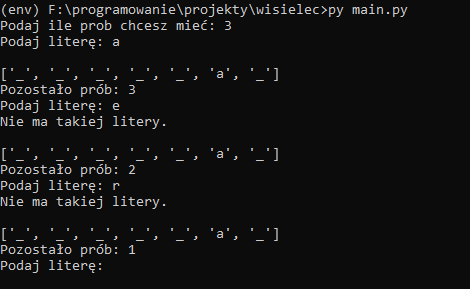

# Wisielec - Python

Prosta gra, uruchamiana z poziomu linii komend. Słowo do odgadnięcia generowane jest automatycznie za pomoca pakietu Faker.



## Instalacja

1. Kopiujemy repozytorium:
    ```
    git clone https://github.com/matt064/hangman_game.git
    ```

2. Tworzymy wirtualne środowisko projektu i je aktywujemy:
    ```
    python -m venv "path_to_catalog"

    venv\Scripts\activate
    ```

3. Instalujemy wymagane pakiety z pliku requirements.txt:
    ```
    (venv) pip install -r requirements
    ```

## Start aplikacji

``` 
py main.py 
```

